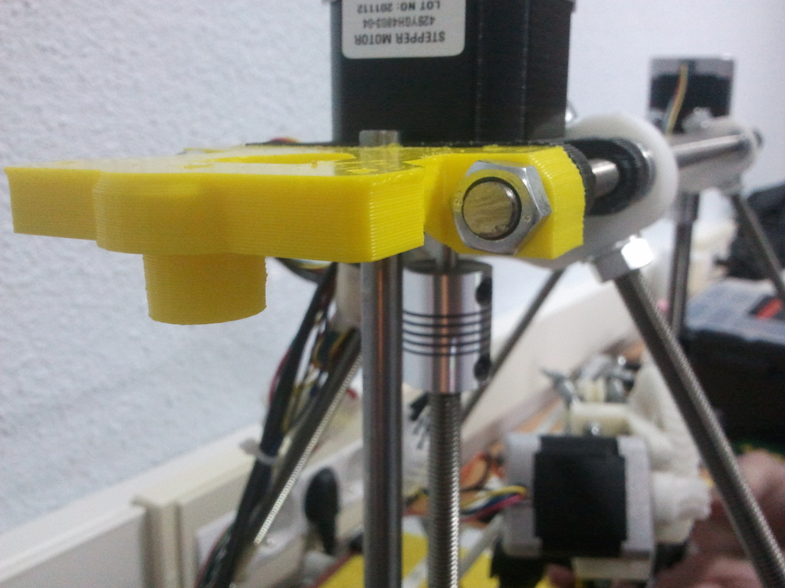
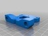
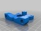
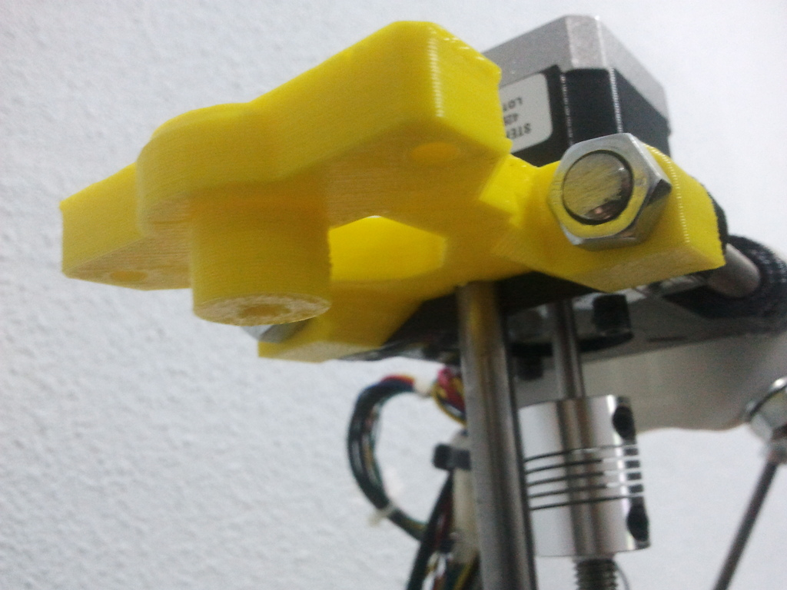
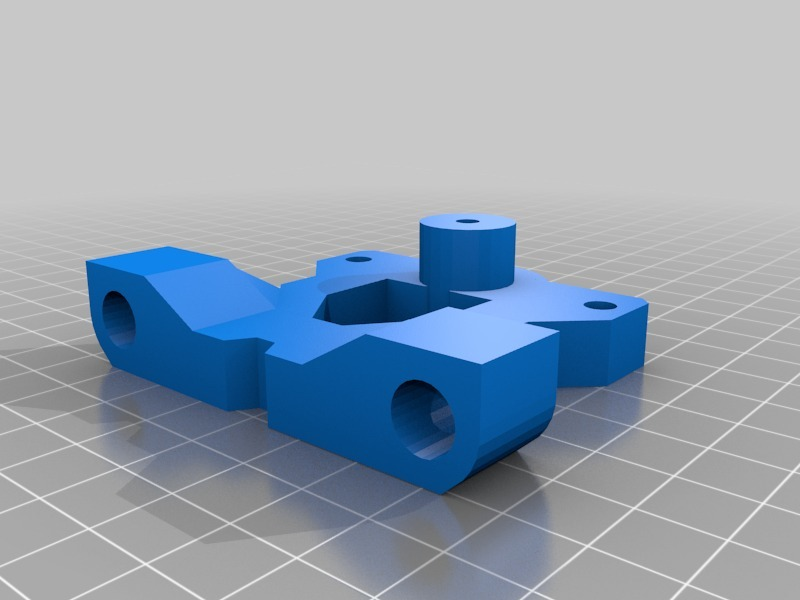
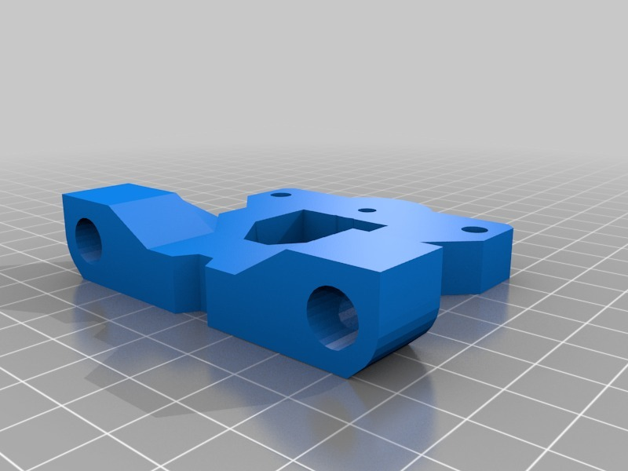

Bowden mount for Greg's or Jonaskuehling extruder
===============
**Please note: This thing is part of a list that was [automatically generated](https://github.com/carlosgs/export-things) and may have been updated since then. Make sure to check for the current license and authorship.**  

Bowden mount for Greg's or Jonaskuehling extruder  by paclema , published Nov 21, 2012

Description
--------

Mount for attach the extruder at the corner of the Prusa Mendel

Instructions
--------

If your extruder have hole, choose the hole mount.
Print and mount it.

Files
--------

 [ Bowden_extruder_mount_no_hole.stl](Bowden_extruder_mount_no_hole.stl)  

 [ Bowden_extruder_mount_no_hole.skp](Bowden_extruder_mount_no_hole.skp)  

 [ Bowden_extruder_mount.stl](Bowden_extruder_mount.stl)  

 [ Bowden_extruder_mount.skp](Bowden_extruder_mount.skp)  

Pictures
--------

Tags
--------
bowden , extruder , extruder_mount , Gregs , Jonaskuehling , prusa  

  

License
--------
Bowden mount for Greg's or Jonaskuehling extruder by paclema is licensed under the Creative Commons - Attribution license.  

By: Pablo Clemente (paclema)
--------
<https://plus.google.com/u/1/102278889535865454061/posts/>