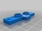
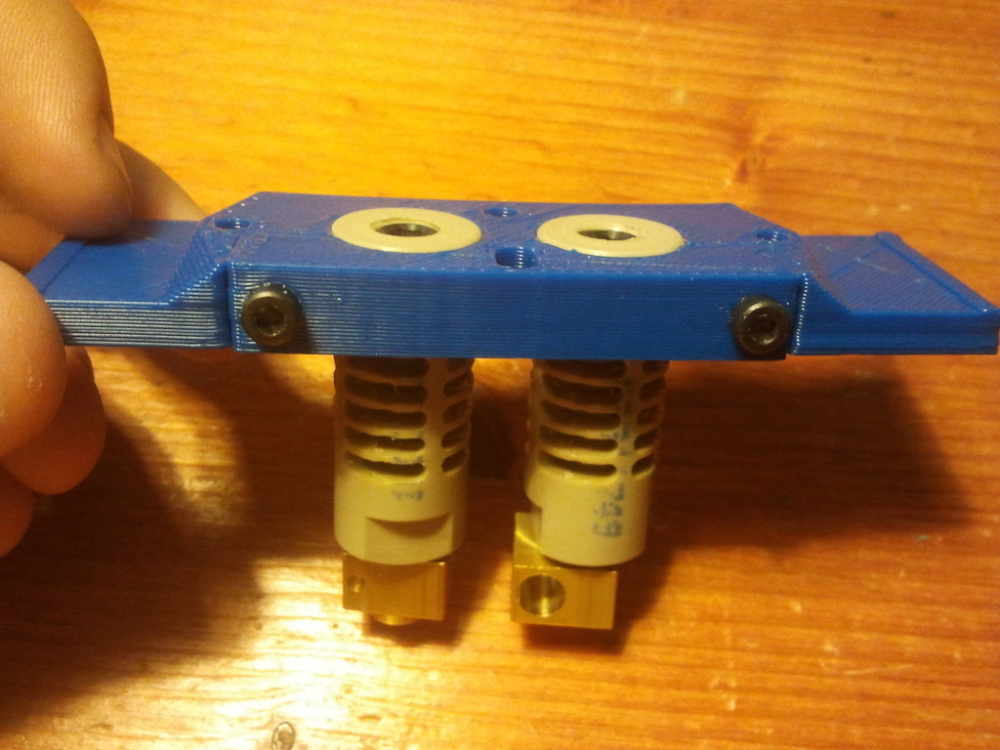

Dual Extruder mount for Prusa with bowden
===============
**Please note: This thing is part of a list that was [automatically generated](https://github.com/carlosgs/export-things) and may have been updated since then. Make sure to check for the current license and authorship.**  

Dual Extruder mount for Prusa with bowden  by paclema , published Jul 27, 2012

Description
--------

This is a plate of the Quick-Fit X carriage ( <a href="http://www.thingiverse.com/thing:19590" rel="nofollow">http://www.thingiverse.com/thing:19590</a> ) for use 2 extruder J-Head Mk V-B and bowden cable.

Instructions
--------

The fan mount is not designed for J-Head Mk V-B but I think It should work with two J-Head Mk IV. 
The distance between the two extruders is 22mm.

For mount the plate, you´ll need:
-x2 M3 30mm bolt
-x4 M3 20mm bolt
-x6 M3 nut
-x12 M3 washer

<ol>
<li>Print 2j-head-mount.stl and 2j-head-mount_cover.stl.</li>
<li>Assemble it.</li>
<li>Print bowden2.stl and insert the bowden adaptations.</li>
<li>Print with 2 colors ;-)</li>
</ol>

Files
--------

 [ Base.skp](Base.skp)  

 [ 2j-head-mount_cover.stl](2j-head-mount_cover.stl)  

 [ 2j-head-mount.stl](2j-head-mount.stl)  

 [ Fan_mount4.skp](Fan_mount4.skp)  

 [ Fan_mount4.stl](Fan_mount4.stl)  

 [ bowden2.skp](bowden2.skp)  

 [ bowden2.stl](bowden2.stl)  

Pictures
--------

Tags
--------
bowden , dual_extrusion , j_head , plastic_valley , prusa , prusa_mendel , quick_fit_x_carriage , reprap  

  

License
--------
Dual Extruder mount for Prusa with bowden by paclema is licensed under the Creative Commons - Attribution license.  

By: Pablo Clemente (paclema)
--------
<https://plus.google.com/u/1/102278889535865454061/posts/>