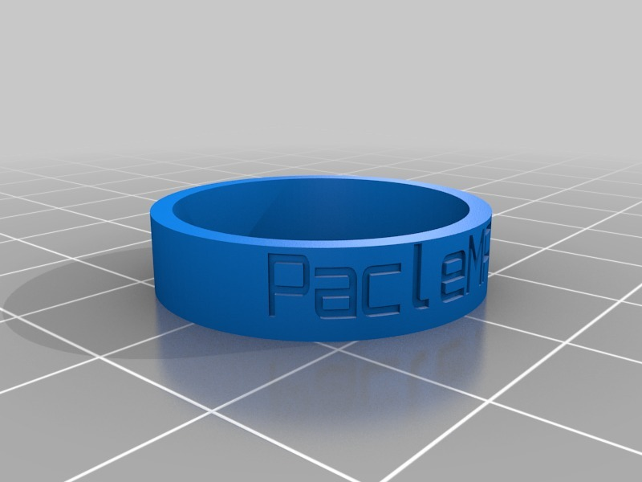

PacleMAKER ring
===============
**Please note: This thing is part of a list that was [automatically generated](https://github.com/carlosgs/export-things) and may have been updated since then. Make sure to check for the current license and authorship.**  

PacleMAKER ring  by paclema , published Jan 8, 2013

Description
--------

Customized version of <a href="http://www.thingiverse.com/thing:40704" rel="nofollow">http://www.thingiverse.com/thing:40704</a>

Created with Customizer! <a href="http://www.thingiverse.com/apps/customizer/run?thing_id=40704" rel="nofollow">http://www.thingiverse.com/apps/customizer/run?thing_id=40704</a>

Instructions
--------

Using the following options:

ring_size = 22.4
ring_thickness = 1.6
message = PacleMAKER
font_size = 10
Font = write/orbitron.dxf
ring_width = 6
font_spacing = 0

Files
--------

 [ message_ring_customizer.scad20130108-23958-xlmmfo-0.stl](message_ring_customizer.scad20130108-23958-xlmmfo-0.stl)  

Tags
--------
customized  

  

License
--------
PacleMAKER ring by paclema is licensed under the Creative Commons - Attribution license.  

By: Pablo Clemente (paclema)
--------
<https://plus.google.com/u/1/102278889535865454061/posts/>